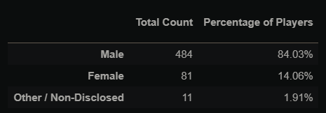
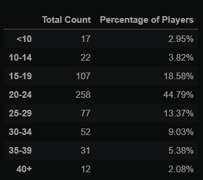
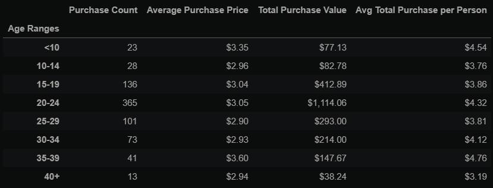

## Background - Pandas

The data dive continues!

Now, it's time to take what you've learned about Python Pandas and apply it to new situations. For this assignment, you'll need to complete **one of two** (not both)  Data Challenges. Once again, which challenge you take on is your choice. Just be sure to give it your all -- as the skills you hone will become powerful tools in your data analytics tool belt.

## Option 1: Heroes of Pymoli

Congratulations! After a lot of hard work in the data munging mines, you've landed a job as Lead Analyst for an independent gaming company. You've been assigned the task of analyzing the data for their most recent fantasy game Heroes of Pymoli.

Like many others in its genre, the game is free-to-play, but players are encouraged to purchase optional items that enhance their playing experience. As a first task, the company would like you to generate a report that breaks down the game's purchasing data into meaningful insights.

Your final report should include each of the following:

### Player Count

* Total Number of Players

### Purchasing Analysis (Total)

* Number of Unique Items
* Average Purchase Price
* Total Number of Purchases
* Total Revenue

### Gender Demographics

* Percentage and Count of Male Players
* Percentage and Count of Female Players
* Percentage and Count of Other / Non-Disclosed

### Purchasing Analysis (Gender)

* The below each broken by gender
  * Purchase Count
  * Average Purchase Price
  * Total Purchase Value
  * Average Purchase Total per Person by Gender

### Age Demographics

* The below each broken into bins of 4 years (i.e. &lt;10, 10-14, 15-19, etc.)
  * Purchase Count
  * Average Purchase Price
  * Total Purchase Value
  * Average Purchase Total per Person by Age Group

### Top Spenders

* Identify the the top 5 spenders in the game by total purchase value, then list (in a table):
  * SN
  * Purchase Count
  * Average Purchase Price
  * Total Purchase Value

### Most Popular Items

* Identify the 5 most popular items by purchase count, then list (in a table):
  * Item ID
  * Item Name
  * Purchase Count
  * Item Price
  * Total Purchase Value

### Most Profitable Items

* Identify the 5 most profitable items by total purchase value, then list (in a table):
  * Item ID
  * Item Name
  * Purchase Count
  * Item Price
  * Total Purchase Value

As final considerations:

* You must use the Pandas Library and the Jupyter Notebook.
* You must submit a link to your Jupyter Notebook with the viewable Data Frames.
* You must include a written description of three observable trends based on the data.

# Analysis

## Gender Analysis

Purchase data based on gender, as shown in Table I, indicates that consumers of Heroes of Pymoli’s microtransactions are mostly male. Accounting for approximately 84% of the gender demographic. While around 14% are female and the remaining 2% are another gender or chose not to disclose gender.
### Table I

While accounting for most purchase value and total purchases, males however spend the least amount of money on average. Summarising from Table II, males spent $4.07 per person on average. While females and other consumers spent $4.47 and $4.56 respectively.

### Table 2 

## Age Analysis

Indicated by Table III, players who purchase microtransactions on Heroes of Pymoli are mainly in the 20-24 age range demographic. Accounting for almost half of purchasers (45%). The next two most common age ranges of purchasers are 15-19, then 25-29. Having a representation of approximately 19% and 13% respectively. These three age groups alone account for just above three quarters of purchasers.

### Table III

The biggest spenders on average based on age demographics are people who of the age of 35 to 39 who spend $4.76 on average as seen in Table IV.  Followed by people who are younger than the age of 10 who spend $4.54 on average. Meanwhile most common age demographic, 20-24, spend on average $4.32.

### Table IV

## Most Popular and Profitable Analysis

The most popular items are ‘Final Critic’ and ‘Oathbreaker, Last Hope of the Breaking Storm’. Reading Table V, they were purchased 13 and 12 times respectively. After that, there have been multiple items that were bought 9 times.

### Table V

From Table VI, Final Critic and Oathbreaker were also the most profitable as their prices were also relatively high. Generating above $100 dollars combined. The next profitable items are ‘Nirvana’, generating $44.10 in profit, and ‘Fiery Glass Crusader’ generating $41.22.

### Table VI 

